# Readme.md

**Lien Github (branche graphicInterface) :** [https://github.com/sebastien-brnt/rpg/tree/graphicInterface/](https://github.com/sebastien-brnt/rpg/tree/graphicInterface/)

## Visuel du jeu :

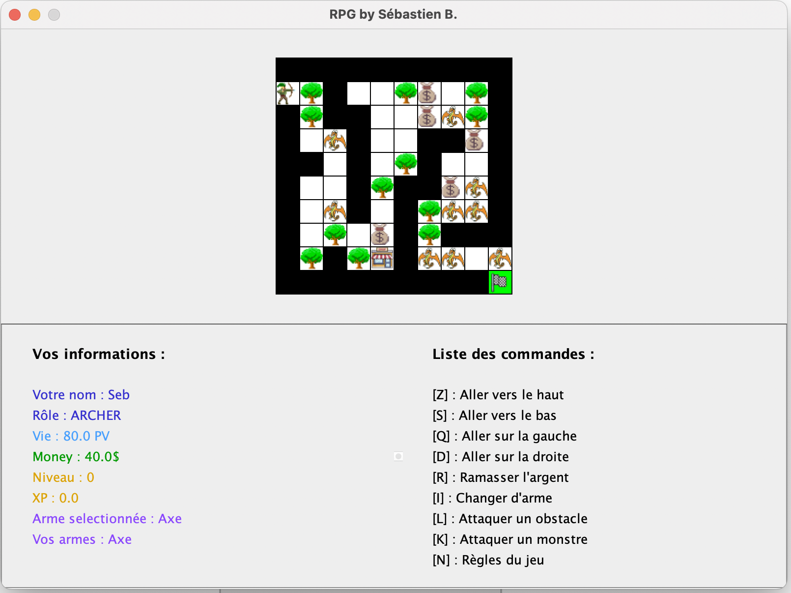

## Fonctionnalités présentes :

- Choix du cast et du nom
    - Avec JDialog spécial
        
        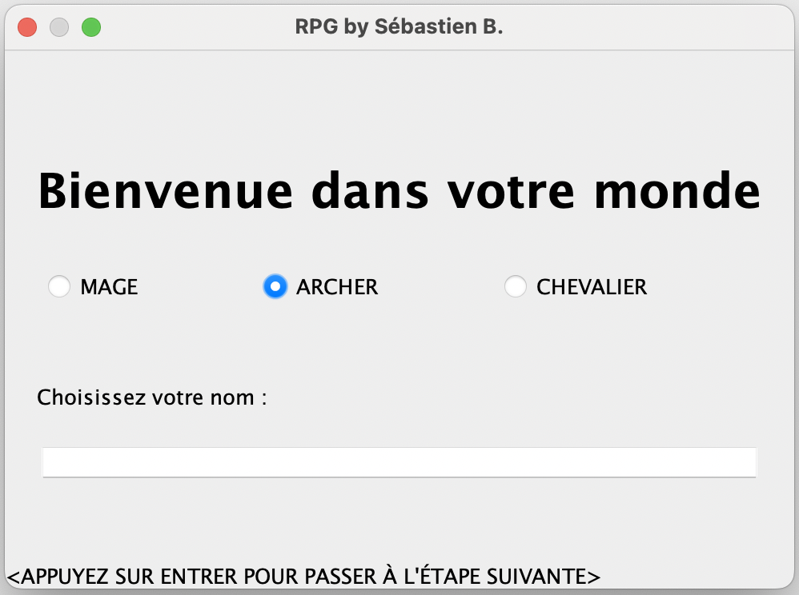
        

- Choix de la première arme
    - Avec JDialog spécial
        
        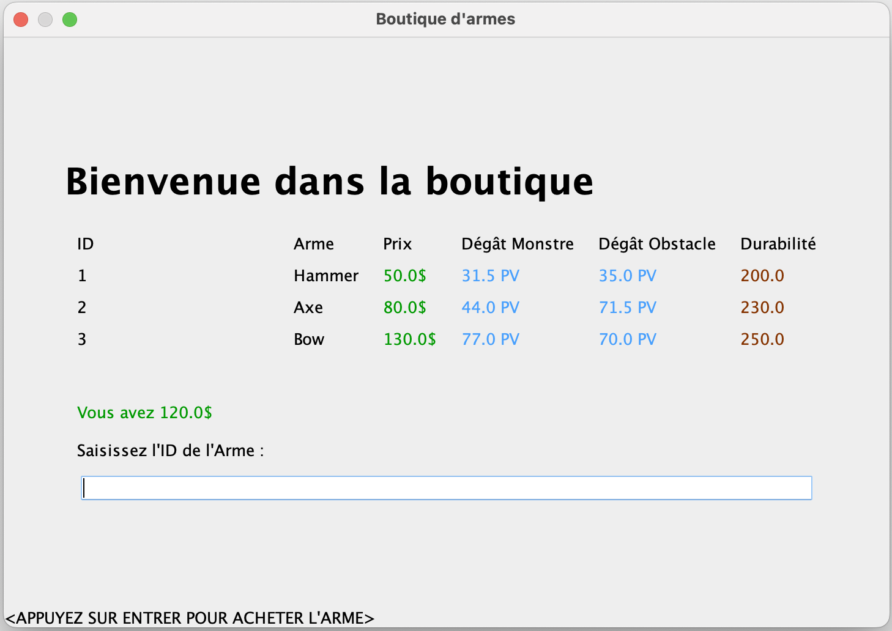
        

- Déplacement du joueur
    
    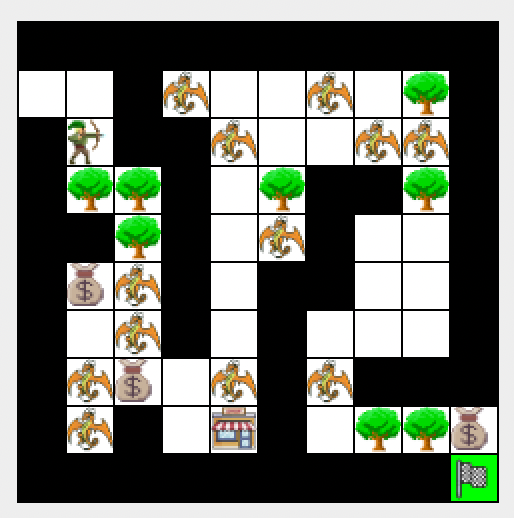
    

- Aller à la boutique
    - Avec JDialog spécial
    
    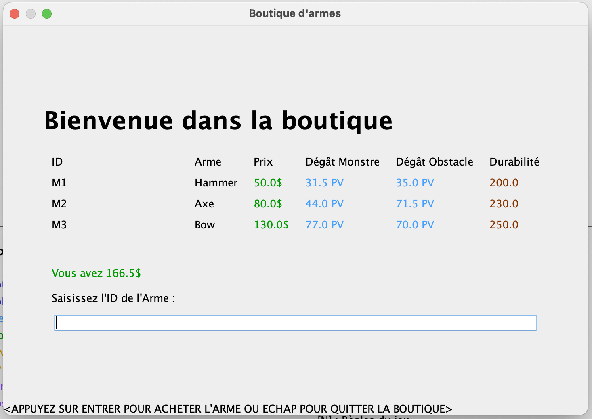
    

- Possibilité de changer d’arme sélectionné
    - Avec JDialog spécial
    
    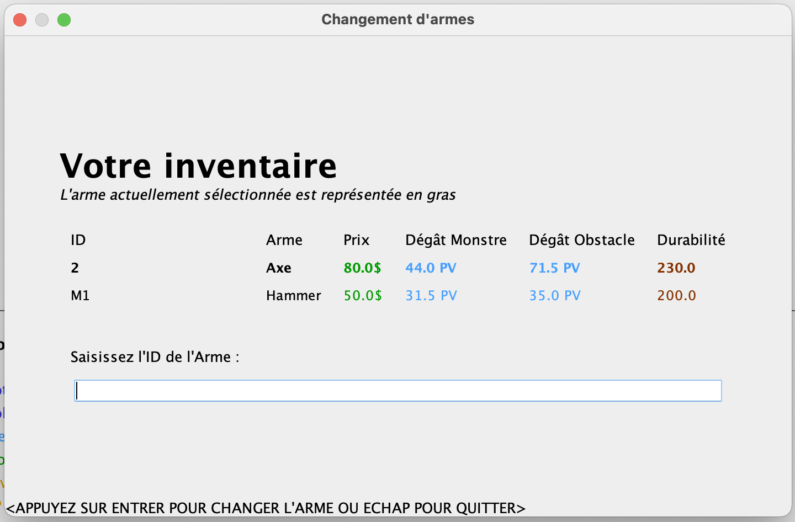
    

- Voir les informations du joueur (PV, XP, Argent, Armes, Arme sélectionnée….)
    
    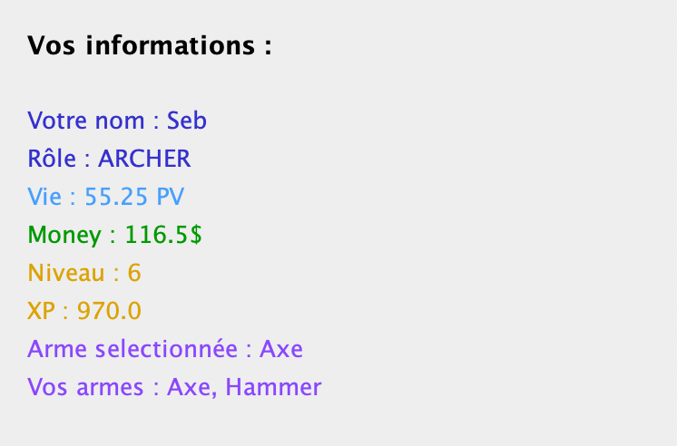
    

- Voir les commandes disponibles
    
    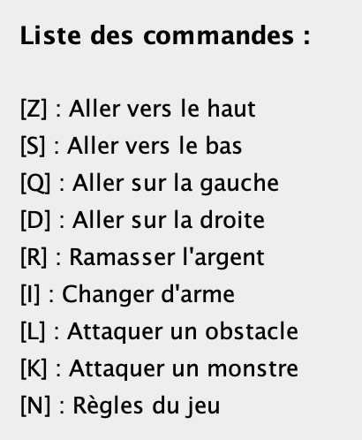
    

- Finir la partie lorsque le joueur arrive sur la case de fin de partie ou qu’il est mort
    
    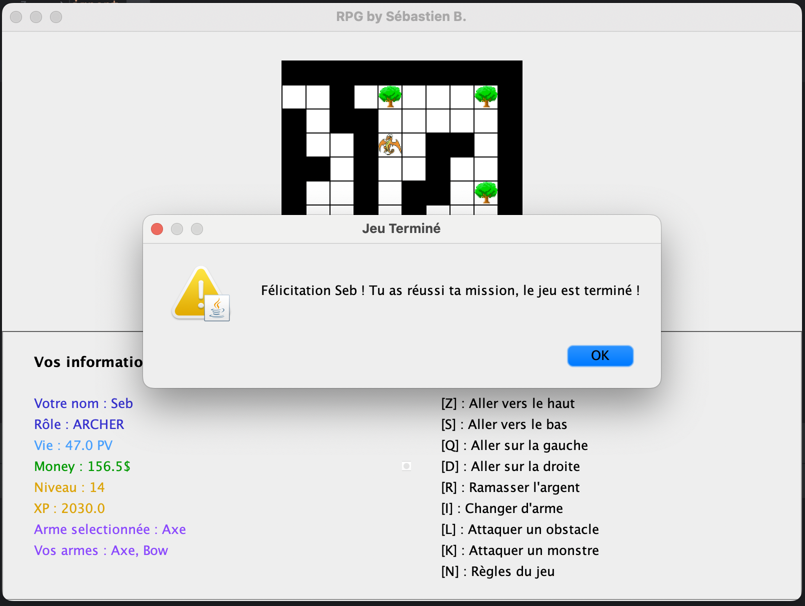
    
    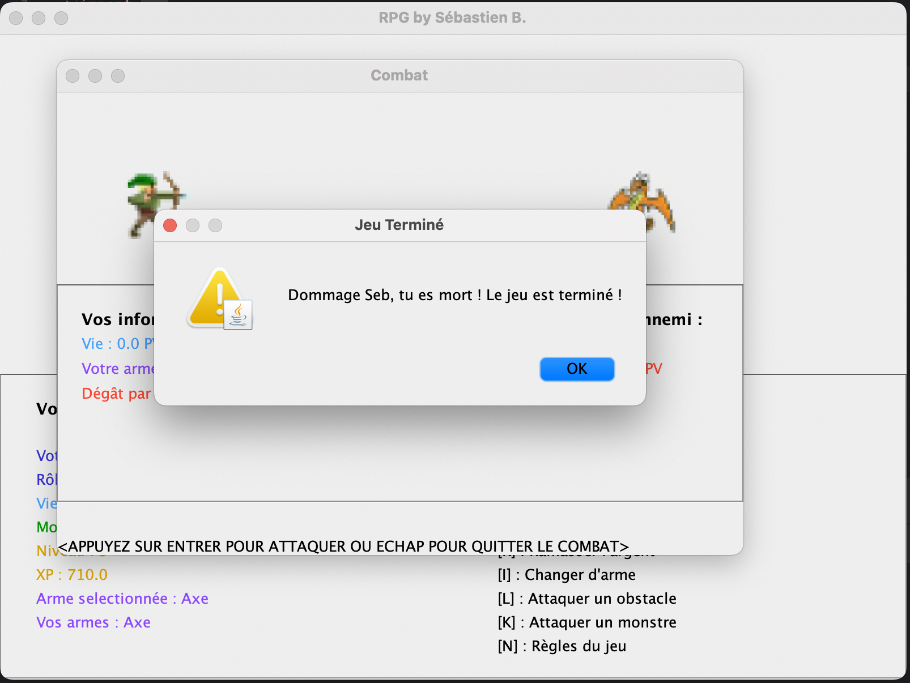
    
- Placement des monstres, obstacles et argents aléatoire sur la map
    
    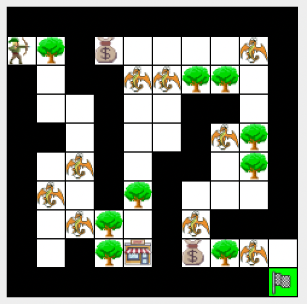
    
    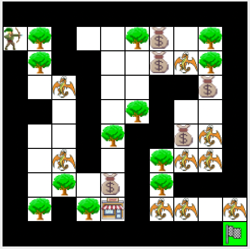
    

- Lors des attaques spécialité différente suivant les casts :
    - Chevalier : 1 chance sur 4 d'infliger 2 fois votre attaque.
    - Archer : 2,5$ et 10 XP par attaque.
    - Mage : 1 chance 2 de gagner 5 PV lors de chaque attaque.
    
- Ramasser de l’argent lorsque le joueur est sur la case
    
    
- Combattre un obstacle lorsque le joueur est à côté
    - Avec JDialog spécial
    
    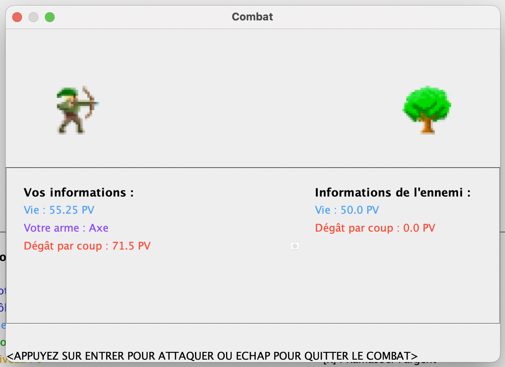
    
- Combattre un monstre lorsque le joueur est à côté
    - Avec JDialog spécial
    
    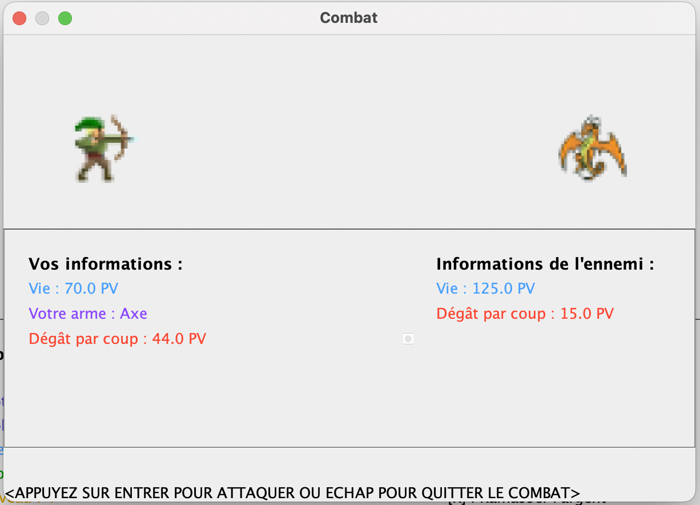
    
- Gain de récompense lors de la destruction d’un obstacle
- Gain de récompense lors de la victoire contre un monstre
- Gain différent de vie suivant le niveau du joueur lors de la victoire contre un mosntre

- Possibilité de voir les règles du jeu
    - Avec JDialog spécial
    
    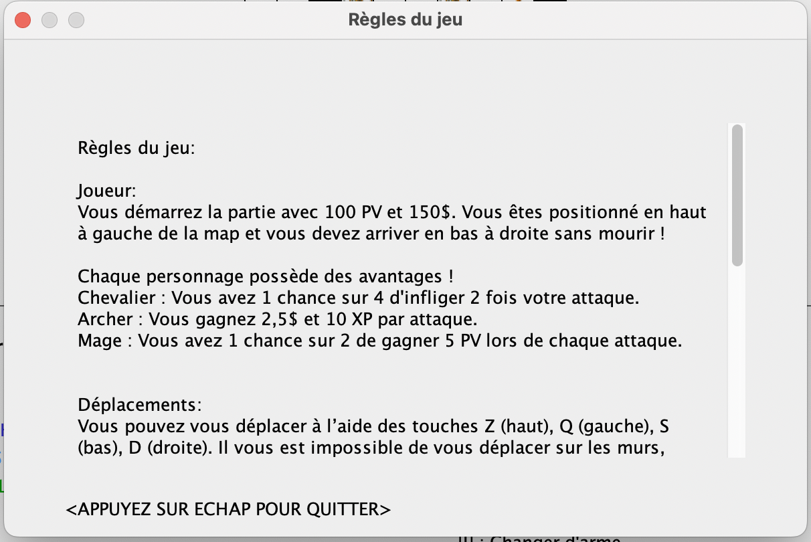